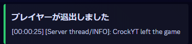

# Minecraft Server Log Monitor

このプロジェクトは、Minecraft サーバーのログファイルを監視し、特定のログエントリを抽出して、Discord チャンネルに Webhook を使って送信するものです。このプロジェクトは、ローカルマシンで実行され、VPS 上で実行されている Minecraft サーバーのログファイルを監視します。

## 機能

- Minecraft サーバーのログファイルを監視して、特定のログエントリを検出します。
- Discord チャンネルに Webhook を使用して通知を送信します。
- 様々なパターンを検索するように設定可能です。
- 同じログエントリの重複通知を防ぎます。
- 監視の開始と終了の通知を Discord に送信します。

## 必要条件

- Node.js (v14 以上)
- NPM (Node Package Manager)

## インストール

1. このリポジトリをクローンします:

    ```bash
    git clone https://github.com/CrockYT/logBot.git
    ```

2. 必要な依存関係をインストールします:

    ```bash
    check require.txt
    ```

3. プロジェクトディレクトリに `config.json` ファイルを作成し、次の内容を記述します。実際の値に置き換えてください:

    ```json
    {
        "logFilePath": "path/to/your/minecraft/logs/latest.log",
        "webhookURL": "https://discord.com/api/webhooks/your_webhook_id/your_webhook_token",
        "checkInterval": 60000
    }
    ```

4. ログモニターを実行します:

    ```bash
    node logBot.js
    ```

## 設定

### `config.json`

- `logFilePath`: Minecraft サーバーのログファイルのパス。
- `webhookURL`: 通知を送信する Discord の Webhook URL。
- `checkInterval`: 新しいエントリのためにログファイルをチェックする間隔（ミリ秒単位）。

### ログパターン

`search.js` ファイルには、モニターが検索するログエントリのパターンが含まれています。必要に応じてこれらのパターンをカスタマイズできます。

## 使用方法

- `node logBot.js` でモニターを開始します。
- モニターは、監視が開始されたことを示す通知を Discord に送信します。
- 特定のログエントリが見つかった場合、それらが Discord チャンネルに送信されます。
- モニターを停止する（例: `Ctrl+C` を押す）と、監視が終了したことを示す通知が Discord に送信されます。

## 例

サーバーが起動すると、Discord チャンネルに次のような通知が表示されることがあります:


プレイヤーがゲームに参加すると、次のような通知が表示されることがあります:


プレイヤーがゲームから退出すると、次のような通知が表示されることがあります:



サーバーが停止すると、次のような通知が表示されることがあります:


動画での例はこちらをご覧ください
https://x.com/Crock_fnexYT/status/1814321286224699569

## ライセンス

このプロジェクトは MIT ライセンスの下でライセンスされています。詳細は [LICENSE](LICENSE) ファイルを参照してください。

## コントリビュート

バグを見つけたり改善の提案がある場合は、問題をオープンするかプルリクエストを提出してください。

## 謝辞

貴重なリソースとサポートを提供してくれた貢献者とオープンソースコミュニティに感謝します。
